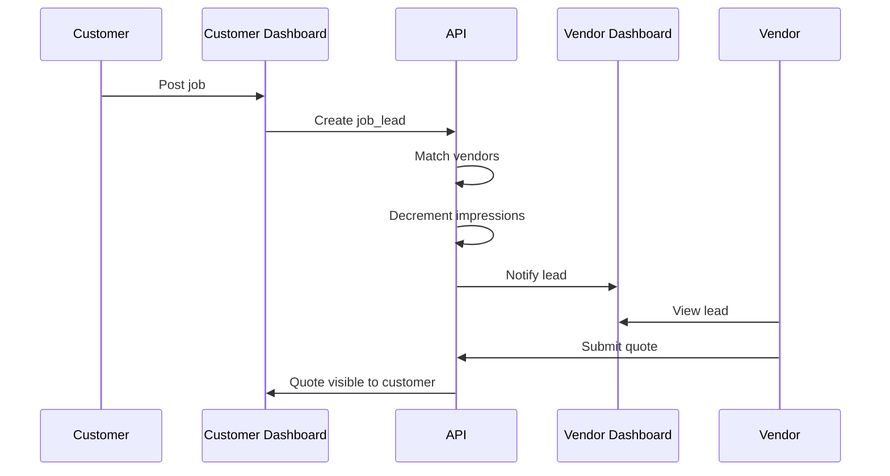
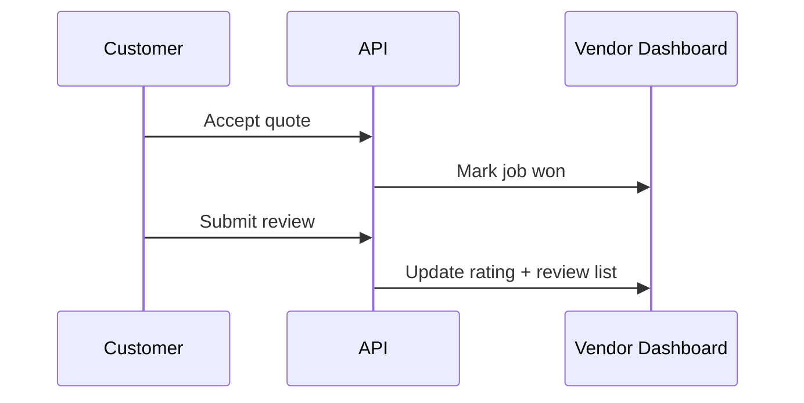

# Vendor Dashboard Architecture

## 1) Dashboard Scope
The Vendor Dashboard is the primary workspace for tradespeople to acquire jobs, manage quotes, track impression usage, maintain reputation, and manage billing. It integrates with the Customer Dashboard for end-to-end job lifecycle and review flows.

### Core Capabilities
- Lead intake and qualification
- Impression usage tracking and auto-pause
- Quote creation and lifecycle management
- Job status tracking (won/active/archived)
- Review collection and reputation management
- Billing and subscription management via Stripe
- Profile and service coverage management
- Notification management and escalation

### Layout Overview
- Left sidebar navigation (collapsible categories)
- Top bar for global search, notifications, and account menu
- Main content area with module-specific views
- Contextual right panel (optional) for detail and actions

### Integration with Customer Dashboard
- Customer posts job → vendor lead delivered → vendor quotes → customer accepts → job won → review collected.
- Shared entities: quotes, job_leads, reviews, notifications, payments.

---

## 2) UI / UX Structure

### Left Sidebar Tree (Collapsible)
```
Vendor Dashboard
├─ Overview
│  ├─ Dashboard Home
│  └─ Performance Snapshot
├─ Leads & Jobs
│  ├─ New Job Leads
│  ├─ Active Quotes
│  ├─ Won Jobs
│  └─ Archived Jobs
├─ Impressions & Exposure
│  ├─ Impressions Used
│  ├─ Remaining Impressions
│  ├─ Usage Timeline
│  ├─ Predictive Exhaustion
│  └─ Auto-Pause State
├─ Reviews & Reputation
│  ├─ Reviews Received
│  ├─ Review Requests
│  └─ Trust & Verification Badges
├─ Billing & Subscriptions
│  ├─ Active Plan
│  ├─ Impression Allowance
│  ├─ Top-up Purchases
│  ├─ Invoices
│  └─ Stripe Customer Portal
├─ Profile & Services
│  ├─ Business Profile
│  ├─ Services Offered
│  ├─ Coverage Locations
│  └─ Certifications
├─ Notifications
│  ├─ Email Alerts
│  ├─ In-app Alerts
│  └─ Usage Warnings (80% / 95%)
└─ Settings
   ├─ Account
   ├─ Security
   └─ Notification Preferences
```

### UX Details
- Collapsible categories with chevron indicators.
- Icon + label for each top-level category.
- Active route highlighting and breadcrumb trail.
- Persistent filters and search for Leads & Jobs.
- Inline alerts for impression thresholds and auto-pause.

---

## 3) Data Models (SQL)

### vendors
```sql
CREATE TABLE vendors (
  id TEXT PRIMARY KEY,
  user_id TEXT UNIQUE NOT NULL,
  status TEXT NOT NULL DEFAULT 'active',
  impressions_balance INTEGER NOT NULL DEFAULT 0,
  impressions_used INTEGER NOT NULL DEFAULT 0,
  auto_pause BOOLEAN NOT NULL DEFAULT false,
  auto_pause_reason TEXT,
  average_rating NUMERIC(3,2) DEFAULT 0,
  review_count INTEGER NOT NULL DEFAULT 0,
  created_at TIMESTAMP NOT NULL DEFAULT NOW(),
  updated_at TIMESTAMP NOT NULL DEFAULT NOW()
);
CREATE INDEX idx_vendors_status ON vendors(status);
```

### vendor_profiles
```sql
CREATE TABLE vendor_profiles (
  id TEXT PRIMARY KEY,
  vendor_id TEXT NOT NULL REFERENCES vendors(id) ON DELETE CASCADE,
  business_name TEXT NOT NULL,
  description TEXT,
  website_url TEXT,
  phone TEXT,
  email TEXT,
  logo_url TEXT,
  years_experience INTEGER,
  verification_status TEXT DEFAULT 'unverified',
  created_at TIMESTAMP NOT NULL DEFAULT NOW(),
  updated_at TIMESTAMP NOT NULL DEFAULT NOW()
);
CREATE INDEX idx_vendor_profiles_vendor ON vendor_profiles(vendor_id);
```

### vendor_services
```sql
CREATE TABLE vendor_services (
  id TEXT PRIMARY KEY,
  vendor_id TEXT NOT NULL REFERENCES vendors(id) ON DELETE CASCADE,
  service_key TEXT NOT NULL,
  service_name TEXT NOT NULL,
  active BOOLEAN NOT NULL DEFAULT true,
  created_at TIMESTAMP NOT NULL DEFAULT NOW(),
  updated_at TIMESTAMP NOT NULL DEFAULT NOW()
);
CREATE INDEX idx_vendor_services_vendor ON vendor_services(vendor_id);
CREATE INDEX idx_vendor_services_key ON vendor_services(service_key);
```

### vendor_locations
```sql
CREATE TABLE vendor_locations (
  id TEXT PRIMARY KEY,
  vendor_id TEXT NOT NULL REFERENCES vendors(id) ON DELETE CASCADE,
  postcode TEXT NOT NULL,
  radius_miles INTEGER NOT NULL DEFAULT 10,
  created_at TIMESTAMP NOT NULL DEFAULT NOW(),
  updated_at TIMESTAMP NOT NULL DEFAULT NOW()
);
CREATE INDEX idx_vendor_locations_vendor ON vendor_locations(vendor_id);
CREATE INDEX idx_vendor_locations_postcode ON vendor_locations(postcode);
```

### impressions_ledger
```sql
CREATE TABLE impressions_ledger (
  id TEXT PRIMARY KEY,
  vendor_id TEXT NOT NULL REFERENCES vendors(id) ON DELETE CASCADE,
  event_type TEXT NOT NULL, -- debit/credit
  amount INTEGER NOT NULL,
  balance_after INTEGER NOT NULL,
  ref_type TEXT, -- lead/quote/topup/subscription
  ref_id TEXT,
  created_at TIMESTAMP NOT NULL DEFAULT NOW()
);
CREATE INDEX idx_impressions_ledger_vendor ON impressions_ledger(vendor_id);
CREATE INDEX idx_impressions_ledger_ref ON impressions_ledger(ref_type, ref_id);
```

### impression_events
```sql
CREATE TABLE impression_events (
  id TEXT PRIMARY KEY,
  vendor_id TEXT NOT NULL REFERENCES vendors(id) ON DELETE CASCADE,
  lead_id TEXT,
  quote_id TEXT,
  event TEXT NOT NULL, -- delivered/opened/quoted/auto_pause
  metadata JSONB,
  created_at TIMESTAMP NOT NULL DEFAULT NOW()
);
CREATE INDEX idx_impression_events_vendor ON impression_events(vendor_id);
CREATE INDEX idx_impression_events_lead ON impression_events(lead_id);
```

### subscriptions
```sql
CREATE TABLE subscriptions (
  id TEXT PRIMARY KEY,
  vendor_id TEXT NOT NULL REFERENCES vendors(id) ON DELETE CASCADE,
  stripe_customer_id TEXT NOT NULL,
  stripe_subscription_id TEXT,
  plan_key TEXT NOT NULL,
  status TEXT NOT NULL,
  impressions_included INTEGER NOT NULL DEFAULT 0,
  current_period_start TIMESTAMP,
  current_period_end TIMESTAMP,
  cancel_at_period_end BOOLEAN NOT NULL DEFAULT false,
  created_at TIMESTAMP NOT NULL DEFAULT NOW(),
  updated_at TIMESTAMP NOT NULL DEFAULT NOW()
);
CREATE INDEX idx_subscriptions_vendor ON subscriptions(vendor_id);
CREATE INDEX idx_subscriptions_stripe ON subscriptions(stripe_subscription_id);
```

### top_up_purchases
```sql
CREATE TABLE top_up_purchases (
  id TEXT PRIMARY KEY,
  vendor_id TEXT NOT NULL REFERENCES vendors(id) ON DELETE CASCADE,
  stripe_payment_intent_id TEXT NOT NULL,
  impressions_purchased INTEGER NOT NULL,
  amount_gbp INTEGER NOT NULL,
  status TEXT NOT NULL,
  created_at TIMESTAMP NOT NULL DEFAULT NOW(),
  updated_at TIMESTAMP NOT NULL DEFAULT NOW()
);
CREATE INDEX idx_topups_vendor ON top_up_purchases(vendor_id);
CREATE INDEX idx_topups_stripe ON top_up_purchases(stripe_payment_intent_id);
```

### job_leads
```sql
CREATE TABLE job_leads (
  id TEXT PRIMARY KEY,
  customer_id TEXT NOT NULL,
  service_key TEXT NOT NULL,
  postcode TEXT NOT NULL,
  title TEXT,
  description TEXT,
  budget_min INTEGER,
  budget_max INTEGER,
  status TEXT NOT NULL DEFAULT 'open',
  created_at TIMESTAMP NOT NULL DEFAULT NOW(),
  updated_at TIMESTAMP NOT NULL DEFAULT NOW()
);
CREATE INDEX idx_job_leads_service ON job_leads(service_key);
CREATE INDEX idx_job_leads_status ON job_leads(status);
```

### quotes
```sql
CREATE TABLE quotes (
  id TEXT PRIMARY KEY,
  lead_id TEXT NOT NULL REFERENCES job_leads(id) ON DELETE CASCADE,
  vendor_id TEXT NOT NULL REFERENCES vendors(id) ON DELETE CASCADE,
  price INTEGER,
  message TEXT,
  timeline TEXT,
  status TEXT NOT NULL DEFAULT 'sent',
  created_at TIMESTAMP NOT NULL DEFAULT NOW(),
  updated_at TIMESTAMP NOT NULL DEFAULT NOW()
);
CREATE INDEX idx_quotes_vendor ON quotes(vendor_id);
CREATE INDEX idx_quotes_lead ON quotes(lead_id);
CREATE INDEX idx_quotes_status ON quotes(status);
```

### reviews
```sql
CREATE TABLE reviews (
  id TEXT PRIMARY KEY,
  vendor_id TEXT NOT NULL REFERENCES vendors(id) ON DELETE CASCADE,
  customer_id TEXT NOT NULL,
  lead_id TEXT,
  quote_id TEXT,
  rating INTEGER NOT NULL,
  comment TEXT,
  created_at TIMESTAMP NOT NULL DEFAULT NOW(),
  updated_at TIMESTAMP NOT NULL DEFAULT NOW()
);
CREATE INDEX idx_reviews_vendor ON reviews(vendor_id);
CREATE INDEX idx_reviews_customer ON reviews(customer_id);
```

### notifications
```sql
CREATE TABLE notifications (
  id TEXT PRIMARY KEY,
  user_id TEXT NOT NULL,
  user_type TEXT NOT NULL, -- vendor/customer/admin
  title TEXT NOT NULL,
  message TEXT NOT NULL,
  type TEXT NOT NULL, -- info/warn/error
  read BOOLEAN NOT NULL DEFAULT false,
  metadata JSONB,
  created_at TIMESTAMP NOT NULL DEFAULT NOW()
);
CREATE INDEX idx_notifications_user ON notifications(user_id, user_type);
```

---

## 4) Backend APIs (Express / REST)

### Vendor Overview Stats
- **GET /api/vendor/overview**
  - Auth: Vendor JWT
  - Response: `{ impressionsBalance, impressionsUsed, activeQuotes, wonJobs, averageRating, reviewCount }`
  - Errors: 401, 404

### Impression Tracking + Decrement
- **POST /api/impressions/decrement**
  - Auth: Service-to-service + Vendor context
  - Body: `{ vendorId, leadId, amount }`
  - Response: `{ success, balanceAfter, autoPaused }`
  - Errors: 400, 409 (insufficient), 429

### Lead Delivery
- **POST /api/leads/deliver**
  - Auth: System
  - Body: `{ leadId, vendorIds[] }`
  - Response: `{ deliveredCount }`
  - Errors: 400, 409

### Quote Submission
- **POST /api/vendor/quotes**
  - Auth: Vendor JWT
  - Body: `{ leadId, price, message, timeline }`
  - Response: `{ quoteId, status }`
  - Errors: 400, 403

### Auto-Pause Logic
- **POST /api/impressions/auto-pause**
  - Auth: System/Admin
  - Body: `{ vendorId, reason }`
  - Response: `{ autoPaused: true }`
  - Errors: 400, 404

### Email Alert Triggers
- **POST /api/notifications/usage**
  - Auth: System
  - Body: `{ vendorId, threshold }`
  - Response: `{ sent: true }`
  - Errors: 400

### Stripe Webhooks
- **POST /api/webhooks/stripe**
  - Auth: Stripe signature
  - Body: raw
  - Response: `{ received: true }`
  - Errors: 400

### Admin Overrides
- **POST /api/admin/vendor/impressions**
  - Auth: Admin JWT
  - Body: `{ vendorId, delta, reason }`
  - Response: `{ balanceAfter }`
  - Errors: 403

---

## 5) Stripe Integration
- Plans map to impression quotas: Starter, Pro, Enterprise.
- Checkout sessions create subscriptions with metadata `{vendor_id, plan_key}`.
- One-off top-ups use PaymentIntents with metadata `{vendor_id, impressions}`.
- Webhooks:
  - `invoice.paid` → credit impressions
  - `customer.subscription.updated` → sync status
  - `payment_intent.succeeded` → apply top-up
- Idempotency via Stripe event ID stored in DB.
- Billing state sync updates `subscriptions` and `vendors` balances.

---

## 6) Redis / Concurrency Safety
- Redis counters mirror `impressions_balance`.
- Atomic decrement using `DECRBY` with Lua script validating non-negative.
- Locking for lead delivery using `SETNX` (vendor+lead key).
- Reconciliation job hourly: sync Redis to DB and ledger.

---

## 7) Vendor ↔ User Dashboard Connection

### End-to-End Flow
1. User posts job lead.
2. Matching selects vendors.
3. Impressions decremented per delivery.
4. Vendors notified and can quote.
5. User accepts quote; job becomes won.
6. Review request sent post-completion.
7. Review displayed on vendor profile and dashboard.

### Sequence Diagram: Lead to Quote


### Sequence Diagram: Review


---

## 8) Notifications & Alerting
- 80% usage email alert
- 95% usage email alert
- Auto-pause at 100%
- In-dashboard warning banners
- Admin escalation on repeated auto-pauses

---

## 9) Permissions & Security
- Vendor role: access to own data only.
- Admins can override impressions and view logs.
- Data isolation enforced by vendor_id scope.
- GDPR: data export + delete request handling.
- Audit logging for billing, impressions, and admin overrides.

---

## 10) Non-Functional Requirements
- SEO: vendor profile pages indexed with schema.org.
- Performance: dashboard queries < 200ms p95.
- Scalability: horizontal API scaling, Redis for counters.
- Observability: structured logs, metrics, and tracing.
- Extensibility: plan-based feature flags and module-based UI.
